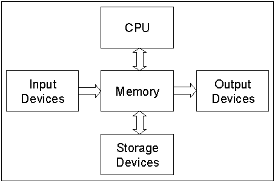

# Basic Structure of Computer

### Computer Hardware

Computer hardware includes the physical parts of a computer such as a motherboard, CPU, hard drive, memory, GPU, power supply, case, cooling system, etc. The following video introduces many of them:




Sometimes, the devices not physically located inside the computer (but connects to the system) are still part of the computer devices such as printer, monitor, speaker, microphone, etc.


### Major Components:

We can divided them into the following categories:

* CPU
* Main Memory (Primary Storage)
* Storage (Secondary Storage)
* Input Devices
* Output Devices

<table><thead><tr><th width="190">Components</th><th width="319">Purpose</th><th>Examples</th></tr></thead><tbody><tr><td><a href="./#cpu-central-processing-unit">CPU</a></td><td>It processes instructions, performs calculations, and manages data flow between hardware components.</td><td>Intel Core i7-14700K, AMD Ryzen 7 9700X, Apple M4...</td></tr><tr><td><a href="./#main-memory">Main Memory</a></td><td>Temporarily stores data and instructions that the CPU needs while performing tasks.</td><td>RAM (<a href="https://en.wikipedia.org/wiki/Random-access_memory">Random Access Memory</a>) and ROM (<a href="https://en.wikipedia.org/wiki/Read-only_memory">Read-only Memory</a>)</td></tr><tr><td><a href="./#secondary-storage">Secondary Storage</a></td><td>Provides long-term data retention, even when the computer is powered off.</td><td>Hard Disk Drive (HDD), Solid-State Drive (SSD)</td></tr><tr><td>Input Devices</td><td>Allow users to interact with the computer by providing data and instructions.</td><td>Keyboard, Mouse, Scanner, Microphone...</td></tr><tr><td>Output Devices</td><td>Display or convey processed data from the computer to the user.</td><td>Monitor, Printer, Speaker...</td></tr></tbody></table>

<figure><figcaption>
Data flow between major components of a computer.
</figcaption></figure>

#### CPU (Central Processing Unit)

The CPU (Central Processing Unit) is a complex microprocessor containing multiple components that work together to **execute instructions** and **perform computations**. The CPU comprises many parts including Control Unit (CU), Arithmetic Logic Unit (ALU), Registers, Buses, Clock, etc.

* Arithmetic Logic Unit: ALU performs **mathematical operations** (addition, subtraction, multiplication, etc), and it handles **logical operations** (AND, OR, NOT, etc).
* Control Unit: CU directs the operation of the CPU by fetching, decoding, and executing instructions, and it manages the **flow of data** between the CPU, memory, and input/output devices.
* Registers: small but high-speed storage units inside the CPU. Registers can temporarily hold data, instructions, or addresses during execution.
* Buses: communication pathways that transmit data and signals within the CPU and to other parts of the computer. There are many types of buses:
  * Data Bus: transfers actual data
  * Address Bus: sends memory addresses where data is stored
  * Control Bus: Carries control signals
* Clock: a clock signal synchronizes the CPU's operations. The **clock speed** (measured in Hz (Hertz), MHz, or GHz) determines how many CPU cycles per second.
  * 1 Hz is 1 cycle per second
  * 1 MHz is 1,000,000 cycles per second
  * 1 GHz is 1,000,000,000 cycles per second.
    * For example, a 5 GHz CPU has 5,000,000,000 cycles every second.

Modern CPUs also have additional features/parts such as cache memory (tiny but extreme fast memory inside CPU), FPU (Floating-Point Unit for complex decimal points operations), AI Cores, etc.

#### Main Memory

Main memory is a vital part of the computer system, bridging the speed gap between the CPU and storage devices. Its efficient management is essential for system performance, as it directly impacts how quickly and smoothly applications run.

#### Secondary Storage

Secondary storage devices are typically non-volatile used for long-term data retention, and they are slower than main memory but much larger. Here are the main types of secondary storage:

* Hard Disk Drives (HDD)
* Solid-State Drives (SSD)
* Optical Storage, such as CDs, DVDs
* Magnetic Tape, mainly used for archival storage and backup.

Please watch the following two videos to understand how HDD and SSD work respectively.


How HDD works?



How SSD works?


### Storage Hierarchy

The storage hierarchy organizes computer storage by speed, cost, and size. Here's a simpler breakdown:

* Registers (



